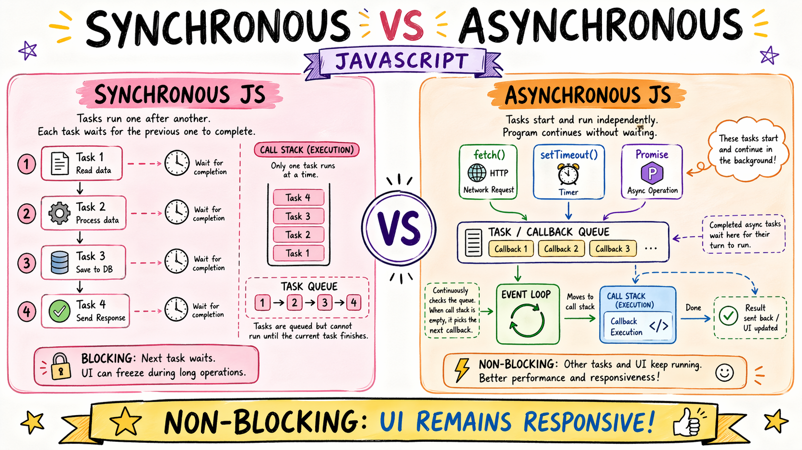
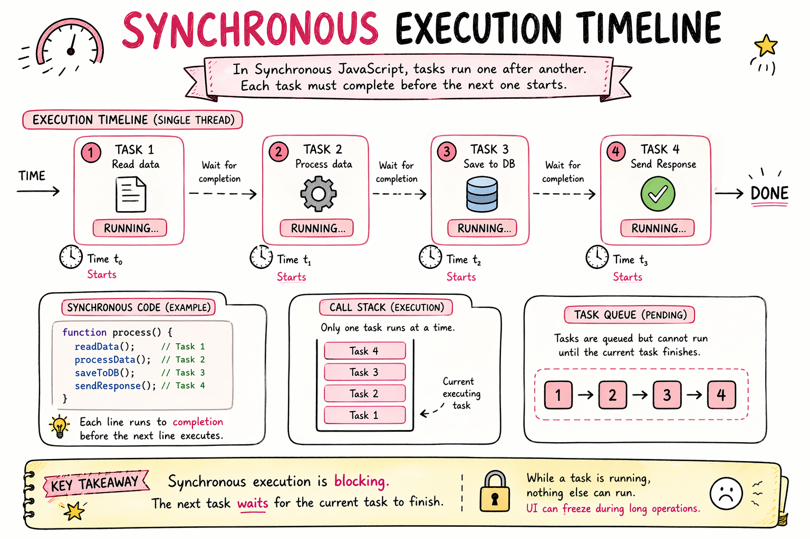
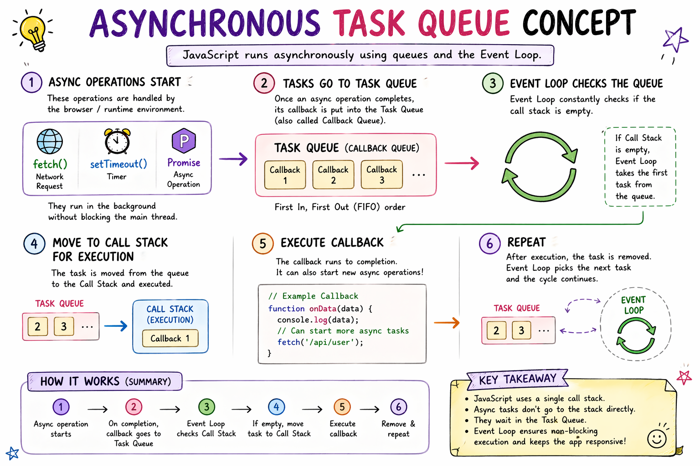

# Synchronous vs Asynchronous JavaScript

When I started learning JavaScript, I thought code runs exactly how we write it.

Line 1 runs.
Then line 2.
Then line 3.

Simple.

And honestly… most of the time, that is true.

But then I used setTimeout() for the first time.

And something weird happened.

console.log("Start");

setTimeout(() => {
  console.log("Inside timer");
}, 2000);

console.log("End");

I expected:

Start

(wait 2 seconds)

Inside timer

End

But I got:

Start

End

Inside timer

And I remember thinking…

“How did End print before the timer?”

That was my first real introduction to synchronous vs asynchronous JavaScript.

What Synchronous Code Means

Synchronous means:

JavaScript executes code one step at a time, in order.

It waits for one task to finish before moving to the next.

Like a queue.

One person at a time.

console.log("Task 1");
console.log("Task 2");
console.log("Task 3");

Output:

Task 1
Task 2
Task 3

Everything happens in sequence.

No surprises.

Think of It Like This

Imagine you’re making tea.

Step 1: Boil water

Step 2: Add tea leaves

Step 3: Pour into cup

You can’t jump to Step 3 before Step 1 finishes.

That’s synchronous behavior.

One task blocks the next until it is done.

What Asynchronous Means

Asynchronous is different.

It means JavaScript can start a task,

move on to other work,

and come back later when that task finishes.

That’s why people call it non-blocking.

It does not make the program wait unnecessarily.

The Timer Example Again

console.log("Start");

setTimeout(() => {
  console.log("Timer done");
}, 2000);

console.log("End");

Output:

Start
End
Timer done

Why?

Because JavaScript says:

Run Start

Timer will take time, send it away for now

Continue with End

Come back when timer finishes

That’s asynchronous behavior.

Blocking vs Non-Blocking Code

This was the part that really made it click for me.

Blocking Code

doTask1();
waitFiveSeconds();
doTask2();

Nothing can move until that 5-second wait finishes.

Everything is stuck.

That is blocking.

Non-Blocking Code

doTask1();

setTimeout(() => {
  doTask2();
}, 5000);

Now JavaScript doesn’t sit idle.

It keeps doing other work.

Much better.

Why JavaScript Needs Asynchronous Behavior

This becomes obvious when dealing with slow operations.

Like:

Fetching API data

Loading files

Database queries

Timers

User actions (clicks, typing)

Imagine calling an API takes 5 seconds.

If JavaScript blocked everything while waiting…

The page would freeze.

Buttons wouldn’t work.

UI would feel broken.

That would be terrible.

Asynchronous behavior solves that.

Real Example — API Call

This is where I started seeing why async matters.

console.log("Loading user...");

fetch("/api/user")
.then(response => response.json())
.then(data => {
  console.log(data);
});

console.log("Other code runs");

Output might be:

Loading user...
Other code runs
(user data later)

JavaScript doesn’t stop the whole program while waiting for data.

It continues.

That’s the whole idea.

Everyday Analogy That Helped Me

Imagine ordering food in a restaurant.

Synchronous way

You order.

Then stand at the counter doing nothing

until food is ready.

Waste of time.

Asynchronous way

You order.

Go sit.

Talk to friends.

Check your phone.

Food arrives later.

Much smarter.

That’s basically async.

Simple Execution Timeline (Visual Idea)

Synchronous

Task 1 → Task 2 → Task 3

Everything waits.

Asynchronous

Task 1 → Start API Request
       → Continue Other Work
       → API Response Arrives Later

Work doesn’t stop.

What Happens Behind the Scenes (Simple Version)

You may hear people mention task queue.

At beginner level, just think:

Slow tasks go aside temporarily

JavaScript keeps running normal code

Finished tasks return later to be executed

That mental model is enough for now.

Small Practice Example

Try this:

console.log("A");

setTimeout(() => {
  console.log("B");
}, 0);

console.log("C");

Many beginners expect:

A
B
C

But actual output:

A
C
B

And that surprises almost everyone 😄

It surprised me too.

Problems with Blocking Code

If everything were synchronous only:

Apps would freeze while waiting

Slow APIs would stop the whole page

User experience would be poor

Large applications would feel unusable

That’s why asynchronous behavior is essential.

Not optional.

Essential.

Key Difference I Remember

I personally remember it like this:

Synchronous → wait and then move

Asynchronous → move, and handle result later

Very simple.

Conclusion

Learning synchronous vs asynchronous changed how I looked at JavaScript.

Before this, I thought code just runs top to bottom.

Now I understand:

Sometimes JavaScript waits.

Sometimes it doesn’t.

And that flexibility is what makes modern web apps possible.

APIs.

Timers.

Real-time apps.

All of that depends on asynchronous behavior.

If you're learning JavaScript, spend time playing with setTimeout(), fetch(), and simple async examples.

Because once this clicks…

Promises and async/await become much easier later.

If you like this simple learning-style explanation,
I write more notes at
devwithsahil.hashnode.dev
and share daily progress on LinkedIn 🙂