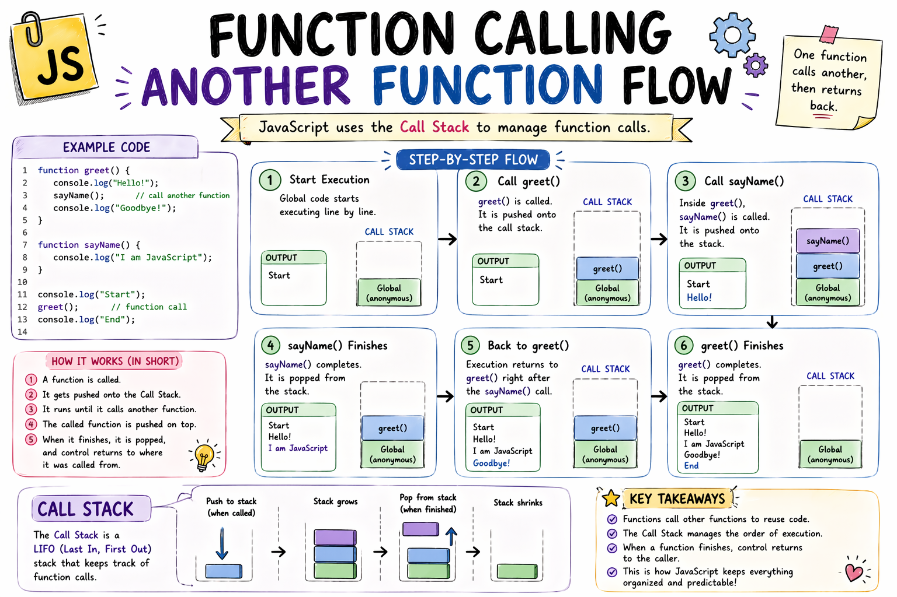
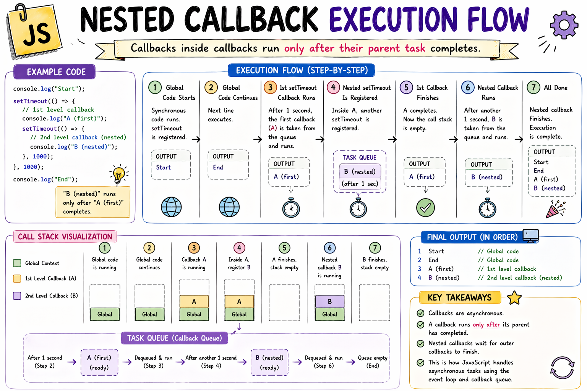

# Callbacks in JavaScript: Why They Exist

When I first heard the word callback, I thought it sounded much more complicated than it actually was.

I imagined it was some advanced JavaScript feature.

But when I finally understood it, I realized…

I had already been using the idea without knowing the name.

And that happens a lot in JavaScript.

First, A Small Realization

One thing that surprised me as a beginner was this:

In JavaScript, functions are values.

Just like numbers.

Just like strings.

You can store them in variables.

let greet = function () {
  console.log("Hello");
};

You can pass them around.

You can even send them into another function.

And that is where callbacks begin.

What Is a Callback Function?

A callback is simply:

A function passed into another function to be run later.

That's all.

Really.

Here's a simple example.

function sayHi() {
  console.log("Hi");
}

function execute(fn) {
  fn();
}

execute(sayHi);

Output:

Hi

Here:

sayHi is the callback

execute receives it

then runs it

That's a callback.

Very simple.

The Real Reason Callbacks Exist

Here's the core truth:

JavaScript cannot predict when something finishes.

When will the user click?

When will the API respond?

When will the timer complete?

Nobody knows.

Not you. Not JavaScript.

So how do you write code for something that happens at an unknown time?

You hand JavaScript a function and say:

"I don't know when. But WHEN it happens… run this."

That's a callback.

Not magic. Just a function waiting for a moment that hasn't arrived yet.

Why Would We Do This?

This was my next question.

Why pass a function into another function at all?

Reason 1: Flexibility

Instead of hardcoding one behavior… we can decide later what should happen.

function processUser(action) {
  console.log("Processing...");
  action();
}

Now we can pass different callbacks:

processUser(function () {
  console.log("Send email");
});

Or:

processUser(function () {
  console.log("Show notification");
});

Same function. Different behavior.

That felt powerful when I first understood it.

Reason 2: Handling Unknown Timing

This is the bigger reason.

When something takes an unknown amount of time, you can't just write code after it and expect it to wait.

Callbacks solve that by saying: "Run this when you're ready."

Where Callbacks Become Really Important — Asynchronous Code

Callbacks became much more important when I learned asynchronous JavaScript.

Remember timers?

setTimeout(function () {
  console.log("Done after 2 seconds");
}, 2000);

The function inside setTimeout is a callback.

JavaScript says:

"Wait 2 seconds… then run this function."

That "run this later" part is exactly why callbacks exist.

Why Callbacks Are Used in Async Programming

Because many tasks take time:

API requests

Reading files

Timers

Database operations

And we often want something to happen after they finish.

Callbacks help define that "after."

getData(function () {
  console.log("Data loaded");
});

Meaning:

"When data finishes loading, run this."

Very natural idea.

Everyday Analogy That Helped Me

Imagine ordering food.

You tell the restaurant:

"When my food is ready, call me."

That "call me when done" instruction…

That is basically a callback.

You give them a task to execute later.

That's all.

Common Places You See Callbacks

Once I noticed callbacks, I started seeing them everywhere.

Timers:

setTimeout(function () {
  console.log("Timer complete");
}, 1000);

Event Listeners:

button.addEventListener("click", function () {
  console.log("Button clicked");
});

That function runs later when user clicks.

Callback.

Simple Flow

It helped me think of it like this:

Main Function
   ↓
Receives Callback
   ↓
Runs Callback Later (when something happens)

The Problem That Came Later — Nested Callbacks

Callbacks are useful.

But too much nesting can become messy.

Something like this:

login(function () {
  getProfile(function () {
    loadPosts(function () {
      console.log("Done");
    });
  });
});

This starts drifting to the right… and becoming hard to read.

People call this callback hell.

And yes… the name makes sense 😅

Why Callback Nesting Becomes a Problem

Problems happen when:

Code becomes deeply nested

Harder to debug

Harder to understand order

Error handling gets messy

That's one reason Promises and async/await were introduced later.

But understanding callbacks comes first.

Because those newer concepts are built on the same idea.

Small Practice Example

Try this:

function greet(name, callback) {
  console.log("Hello " + name);
  callback();
}

greet("Sahil", function () {
  console.log("Welcome!");
});

Output:

Hello Sahil
Welcome!

Very simple callback.

But it builds the core idea.

What Finally Made It Click for Me

I stopped thinking:

"Callback is some special feature."

And started thinking:

"It is just a function being used later."

That made everything simpler.

Conclusion

Learning callbacks helped me understand something deeper about JavaScript.

Functions are not just things we run.

They can also be passed around.

Stored.

Delayed.

Triggered later.

Callbacks exist because JavaScript can't wait. And instead of freezing, it says: "I'll remember what to do. Just tell me when."

That idea powers a huge part of JavaScript:

Timers

Events

Async behavior

All connected.

If you're learning JavaScript right now, practice simple callbacks first before jumping into Promises.

Because once callbacks make sense…

the rest starts feeling much easier.

If you like this simple learning-style explanation, I write more notes at devwithsahil.hashnode.dev and share daily progress on LinkedIn 🙂