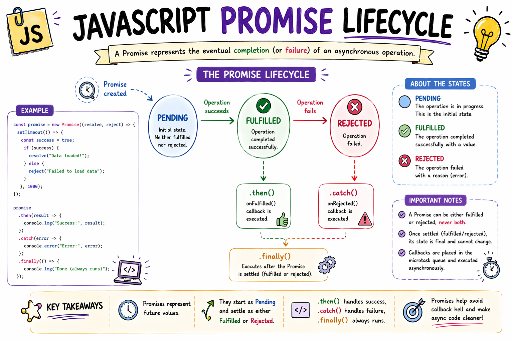

# JavaScript Promises Explained for Beginners

In the last blog, we looked at Callbacks.

We saw that they are just functions waiting to be run later.

But we also saw the dark side of callbacks.

The dreaded Callback Hell.

When you have many slow tasks that depend on each other, callbacks get messy.

Deeply nested code.

Hard to read.

Hard to fix.

JavaScript needed a cleaner way to handle things that take time.

And that is why Promises were created.

What Is a Promise?

A Promise in JavaScript is exactly what it sounds like in real life.

Imagine you go to a busy burger joint.

You order a burger.

You pay.

But you don't get your food immediately.

Instead, the cashier gives you a small buzzer.

That buzzer is a promise.

The restaurant is promising you: "We don't have your food right now, but we promise to give it to you when it's ready."

You can go sit down.

You can talk to your friends.

You can hold that buzzer in your hand, knowing it represents your future burger.

The Three States of a Promise

Just like that buzzer, a JavaScript Promise can only be in one of three states.

1. Pending

You are holding the buzzer.

You don't have the food yet.

The restaurant hasn't failed, but they haven't succeeded yet either.

The task is still running.

2. Fulfilled (Resolved)

The buzzer starts flashing and vibrating.

Your food is ready!

The promise was kept successfully.

You get your data.

3. Rejected

The cashier comes to your table.

They tell you they are completely out of burger buns.

The promise was broken.

An error happened.

How It Looks in Code

Let's look at how we consume a promise.

Most of the time, you will not be creating promises from scratch.

You will be using promises that other parts of JavaScript (like fetch) give to you.

console.log("Ordering data...");

fetch("https://api.github.com/users/sahil")
.then((response) => {
  console.log("Data arrived!");
})
.catch((error) => {
  console.log("Something went wrong");
});

console.log("Doing other things...");

How This Works

Notice two very important words in that code.

.then()

.catch()

When you use a Promise, you don't pass a callback deep inside the function anymore.

Instead, the function returns a Promise object immediately (the buzzer).

Then, you attach instructions to that object.

.then()

This is what should happen if the promise is Fulfilled.

"When the buzzer goes off, I will walk to the counter."

.catch()

This is what should happen if the promise is Rejected.

"If they run out of buns, I will ask for a refund."

Why Is This Better Than Callbacks?

At first glance, .then() just looks like another callback.

And technically, it is.

But Promises solve the biggest problem of callbacks: the nesting.

With callbacks, if you need to do three slow things in a row, you nest them inside each other.

Creating a triangle.

With Promises, you chain them downwards.

fetch("/api/user")
.then((user) => getUserPosts(user.id))
.then((posts) => getPostComments(posts[0].id))
.then((comments) => console.log(comments))
.catch((error) => console.log("Failed anywhere along the chain"));

Look at how flat that code is!

It reads like a simple list of instructions.

Get the user.

Then get their posts.

Then get the comments.

If anything goes wrong at any step... catch the error at the very end.

No pyramids.

No messy nesting.

Conclusion

Promises changed everything in JavaScript.

They took the chaotic, messy world of callbacks and organized it.

Instead of passing functions deep into the unknown, JavaScript now hands you a neat little object.

A placeholder for future data.

You attach your .then() and your .catch(), and your code stays clean and flat.

But believe it or not...

JavaScript developers still weren't satisfied.

Even chaining .then() felt a little bit too much like callbacks.

They wanted code that looked completely synchronous.

And that desire led to the final evolution of asynchronous JavaScript: Async/Await.

Which we will cover in the next blog.

If you like this simple learning-style explanation, I write more notes at devwithsahil.hashnode.dev and share daily progress on LinkedIn 🙂