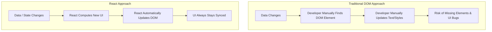
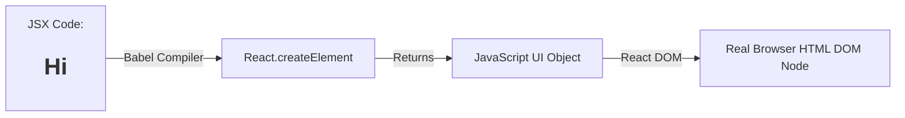
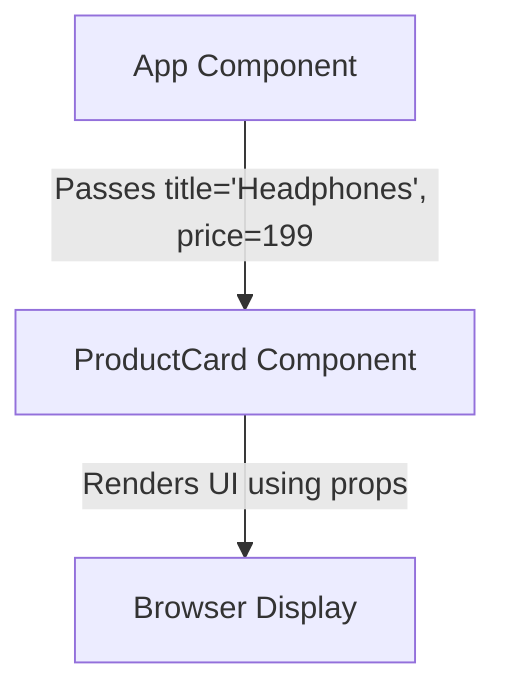
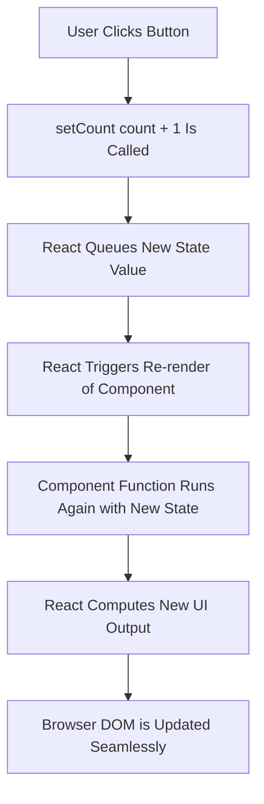
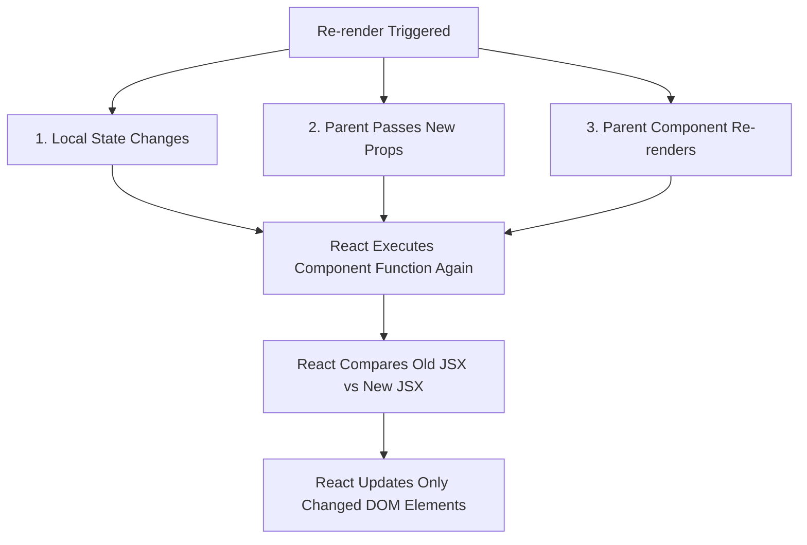
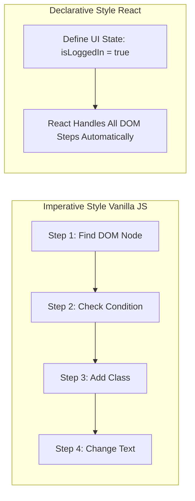
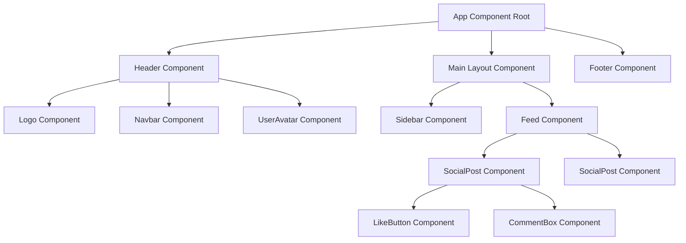
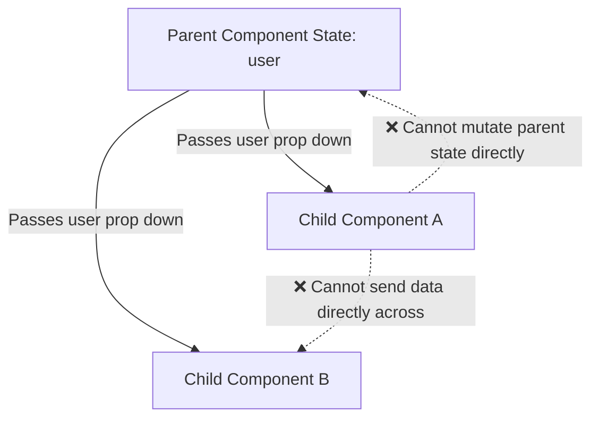
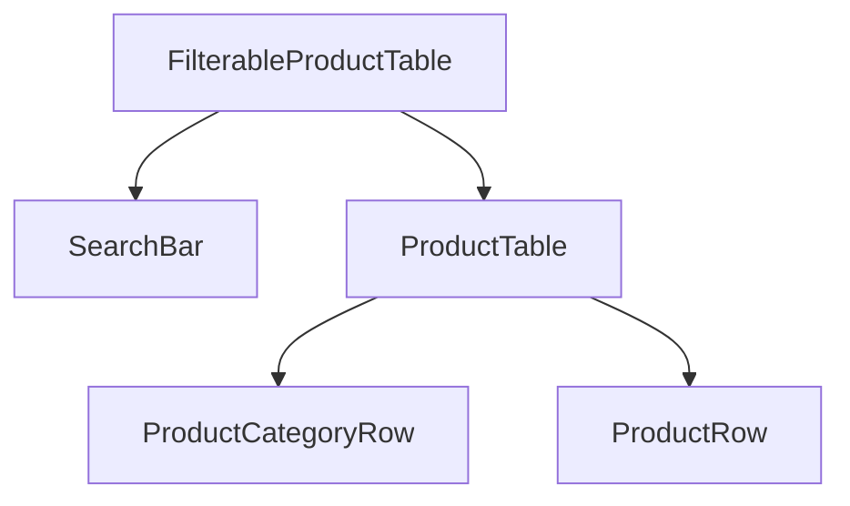

# Why did developers create React when JavaScript already existed?

Think back to when you built your very first interactive webpage using plain vanilla JavaScript.

You probably created a simple counter.

Or maybe a to-do list.

You grabbed a button using `document.getElementById('btn')`.

Then you attached an event listener.

```javascript
const button = document.getElementById('my-button');
const countDisplay = document.getElementById('count-display');

let count = 0;

button.addEventListener('click', () => {
  count++;
  countDisplay.innerText = `Count is: ${count}`;
});
```

At first, this felt like magic.

You clicked the button, and the screen updated.

Everything was simple.

Then you tried to build a real-world application.

Suddenly, you weren't just updating one count display.

You had a shopping cart in the navbar.

A user notification badge in the header.

A list of items on the page.

And a summary section at the bottom.

When a user clicked "Add to Cart", you had to manually find five different DOM elements.

You had to update their text.

You had to toggle CSS classes.

You had to make sure the right data was synced across all of them.

Honestly... it became an absolute nightmare.

I remember building a project where I deleted one `div` in my HTML.

And the entire application broke.

Half of my JavaScript code threw `Cannot read properties of null (reading 'addEventListener')`.

I spent hours tracking down which line of JavaScript was looking for which DOM node.

That was the moment I felt the real pain of manual DOM manipulation.

JavaScript wasn't broken.

The DOM API wasn't broken.

The problem was that managing state and keeping it in sync with the UI manually scale terribly as applications grow.

That pain is precisely why React was created.

---

# 1. Why React Exists

When I first heard about React, I thought it was just a library to make writing JavaScript faster.

I thought, "Why learn a whole framework when I already know JavaScript?"

That confused me for a long time.

Then I realized... React wasn't built to replace JavaScript.

React was built to solve the **UI Synchronization Problem**.

## Problems with Traditional DOM Manipulation

In traditional web development, your data lives in one place (JavaScript variables).

And your UI lives in another place (the browser DOM).

You are the bridge between them.

Every time data changes, you have to manually tell the browser:

1. Find element A.
2. Change its text.
3. Find element B.
4. Add a CSS class.
5. If element C exists, remove it.

Here is what happens when you miss step 3:

Your UI shows old data.

Your user clicks a button, but nothing happens.

Your application enters an invalid state.

## Traditional DOM vs React

Here is a visual model of how traditional JavaScript compares to React:



## UI Complexity and Component-Driven Architecture

Instead of treating a webpage as one massive HTML document glued together with hundreds of lines of DOM selectors...

React introduced **Component-Driven Architecture**.

React asks you to think of your user interface like Lego blocks.

A navbar is a block.

A button is a block.

A user card is a block.

You build small, independent pieces.

Then you assemble them to build complete pages.

```javascript
// Plain Vanilla JS DOM Manipulation Nightmare
function updateCartUI(cartItems) {
  const cartCount = document.querySelector('.cart-count');
  const cartTotal = document.querySelector('.cart-total');
  const cartList = document.querySelector('#cart-items-list');

  cartCount.innerText = cartItems.length;
  
  let total = 0;
  cartList.innerHTML = '';
  
  cartItems.forEach(item => {
    total += item.price;
    const li = document.createElement('li');
    li.textContent = `${item.name} - $${item.price}`;
    cartList.appendChild(li);
  });
  
  cartTotal.innerText = `$${total}`;
}
```

If any DOM element name changed in HTML, this code broke instantly.

React solves this by combining your layout and logic into self-contained components.

When your data updates, React automatically figures out what changed in the UI and updates the DOM for you.

You don't touch the DOM directly anymore.

## What Finally Made It Click

At first, I thought React was just extra syntax I had to memorize.

Then I realized... React is an assistant that takes care of the DOM for you.

Instead of writing code that says "Go change this specific DOM node right now", you tell React "Here is what the UI should look like based on my current data."

React handles all the heavy lifting in the background.

That's the whole idea.

---

# 2. JSX (JavaScript XML)

When I first opened a React code file, my eyes widened.

I saw HTML tags living inside a JavaScript file.

```javascript
function Welcome() {
  return <h1>Hello, world!</h1>;
}
```

I thought: "Wait... isn't putting HTML in JavaScript considered bad practice?"

For years, we were taught to keep HTML, CSS, and JavaScript strictly separated.

That confused me deeply.

## What JSX Is

JSX stands for JavaScript XML.

It is a syntax extension for JavaScript that allows you to write HTML-like markup inside your JavaScript files.

Turns out, JSX is NOT actual HTML.

It looks like HTML.

It smells like HTML.

But under the hood, it is pure JavaScript.

## Why JSX Exists

Before JSX existed, creating dynamic elements in JavaScript looked like this:

```javascript
const element = React.createElement(
  'h1',
  { className: 'greeting' },
  'Hello, world!'
);
```

Imagine building an entire webpage using `React.createElement`.

It would be unreadable.

JSX was created so developers could write UI code using a familiar HTML syntax while keeping the full power of JavaScript.

## HTML vs JSX: Key Differences

Because JSX is JavaScript, it has a few strict rules that differ from plain HTML:

1. **`className` instead of `class`**: `class` is a reserved keyword in JavaScript. So in JSX, we write `className`.
2. **`htmlFor` instead of `for`**: `for` is a reserved keyword in JavaScript (used in loops). So for form labels, we write `htmlFor`.
3. **camelCase Attributes**: Event handlers and attributes use camelCase. `onclick` becomes `onClick`, `tabindex` becomes `tabIndex`.
4. **Self-Closing Tags**: In HTML, tags like `` or `<input>` can be left open. In JSX, all tags MUST be explicitly closed: ``, `<input />`.
5. **Single Root Element**: A JSX block must return a single root tag (or a Fragment `<>...</>`).

```javascript
// HTML
<div class="card">
  
  <label for="username">Name</label>
  <button onclick="handleClick()">Click Me</button>
</div>

// JSX
<div className="card">
  
  <label htmlFor="username">Name</label>
  <button onClick={handleClick}>Click Me</button>
</div>
```

## JavaScript Inside JSX (The Power of `{}`)

The coolest thing about JSX is that you can drop plain JavaScript logic right into your markup using curly braces `{}`.

Think of `{}` as a window into the JavaScript world.

```javascript
function UserGreeting() {
  const username = "Sahil";
  const unreadMessages = 5;

  return (
    <div className="profile">
      <h1>Welcome back, {username}!</h1>
      <p>You have {unreadMessages * 2} pending notifications.</p>
      <p>Account status: {unreadMessages > 0 ? "Active Alerts" : "All Clear"}</p>
    </div>
  );
}
```

Anything inside `{}` is evaluated as a standard JavaScript expression.

## JSX Compilation (Under the Hood)

The browser does NOT understand JSX natively.

If you send raw JSX to a browser, it throws a syntax error.

So how does it work?

A tool called Babel transforms your JSX into standard JavaScript calls before it reaches the browser.



Here is what happens during compilation:

```javascript
// Your JSX Code:
const element = <h1 className="active">Hello React</h1>;

// What Babel turns it into:
const element = React.createElement(
  'h1',
  { className: 'active' },
  'Hello React'
);
```

## A Mistake I Made With JSX

At first, I tried writing an `if` statement directly inside JSX like this:

```javascript
// ❌ THIS FAILS!
function Badge() {
  return (
    <div>
      { if (isOnline) { <span>Online</span> } }
    </div>
  );
}
```

That made me scratch my head.

Then I realized... curly braces inside JSX only accept **expressions** (things that evaluate to a value), not **statements** (like `if`, `for`, or `switch`).

To fix it, I learned to use ternary operators or logical `&&`:

```javascript
// ✅ THIS WORKS!
function Badge({ isOnline }) {
  return (
    <div>
      {isOnline ? <span>Online</span> : <span>Offline</span>}
    </div>
  );
}
```

## What Finally Made It Click

At first, I thought JSX was HTML glued onto JavaScript.

That confused me.

Then I realized... JSX is just a nicer, visually friendly way to write `React.createElement()` function calls.

You don't need to memorize complex rules.

Just remember: inside JSX, whenever you want to use JavaScript variables, math, or functions, wrap them in `{}`.

That made everything connect.

---

# 3. Components

Before React, whenever I built a site, I had a giant `index.html` file that was 1,000 lines long.

Finding a single button in that file felt like hunting for a needle in a haystack.

React fixes this with **Components**.

## What Components Are

A component in React is simply a JavaScript function that returns JSX.

That's literally it.

No secret magic.

```javascript
function WelcomeMessage() {
  return <h2>Welcome to my application!</h2>;
}
```

Think of a component like a custom HTML element that you invented.

Once you define `WelcomeMessage`, you can use it inside JSX just like `<WelcomeMessage />`.

## Reusable UI Blocks

Imagine building a social media feed.

Every post has a user avatar, name, timestamp, text content, and a like button.

Without components, you would duplicate 30 lines of HTML for every single post.

With components, you write the layout once, and reuse it everywhere.

## 5 Practical Component Examples

Let's look at how modern UIs are broken down into clean functional components:

### 1. User Profile Component

```javascript
function UserProfile() {
  return (
    <div className="user-profile-card">
      
      <h3>Sahil Sharma</h3>
      <p className="bio">Full-stack developer building cool web applications.</p>
    </div>
  );
}
```

### 2. Product Card Component

```javascript
function ProductCard() {
  return (
    <div className="product-card">
      <span className="badge">Hot</span>
      <h4>Wireless Mechanical Keyboard</h4>
      <p className="price">$129.99</p>
      <button className="add-btn">Add to Cart</button>
    </div>
  );
}
```

### 3. Navbar Component

```javascript
function Navbar() {
  return (
    <nav className="navbar">
      <div className="logo">DevBlog</div>
      <ul className="nav-links">
        <li><a href="#home">Home</a></li>
        <li><a href="#articles">Articles</a></li>
        <li><a href="#about">About</a></li>
      </ul>
    </nav>
  );
}
```

### 4. Dashboard Widget Component

```javascript
function DashboardWidget() {
  return (
    <div className="widget-box">
      <h5>Total Views</h5>
      <p className="stat-number">24,510</p>
      <span className="growth-text">+14% from last week</span>
    </div>
  );
}
```

### 5. Social Media Post Component

```javascript
function SocialPost() {
  return (
    <article className="post">
      <header className="post-header">
        <strong>@sahil_dev</strong>
      </header>
      <p className="post-content">
        React makes component-driven development feel so natural! 🚀
      </p>
      <footer className="post-footer">
        <button>❤️ Like</button>
        <button>💬 Comment</button>
      </footer>
    </article>
  );
}
```

## Component Composition

Components can render other components.

This is called **Component Composition**.

```javascript
function App() {
  return (
    <main className="app-container">
      <Navbar />
      <section className="content">
        <UserProfile />
        <DashboardWidget />
        <ProductCard />
      </section>
    </main>
  );
}
```

Look how clean `App` is!

You can understand the layout of the entire app in 5 seconds without getting bogged down in low-level HTML tags.

## What Finally Made It Click

At first, I thought React components were complicated objects with lifecycle methods and class abstractions.

That sounded intimidating.

Then I realized... a component is just a plain JavaScript function.

Inputs go in.

JSX comes out.

That simple mental model helped me stop overcomplicating my code.

---

# 4. Props (Properties)

In the previous section, we built a `ProductCard` component.

```javascript
function ProductCard() {
  return (
    <div className="product-card">
      <h4>Wireless Mechanical Keyboard</h4>
      <p className="price">$129.99</p>
    </div>
  );
}
```

That's nice, but there was a major issue.

Every time I rendered `<ProductCard />`, it showed the exact same keyboard for $129.99!

If I wanted to display 10 different products, this component was useless.

That's where **Props** come in.

## What Props Are

Props is short for "Properties".

Props are arguments you pass into a React component, just like passing parameters into a regular JavaScript function.

If components are functions, then **Props are the inputs to those functions**.

```javascript
// Function in regular JS:
function greet(name) {
  return `Hello, ${name}`;
}

// Component in React:
function Greet(props) {
  return <h1>Hello, {props.name}</h1>;
}
```

## Passing Data from Parent to Child

Data in React flows in one direction: **Top-Down** (from Parent to Child).

Here is how a parent passes props down to a child component:



Let's write this in code:

```javascript
// Child Component accepting props
function ProductCard(props) {
  return (
    <div className="product-card">
      <h4>{props.title}</h4>
      <p className="price">${props.price}</p>
      <p className="status">{props.inStock ? "In Stock" : "Out of Stock"}</p>
    </div>
  );
}

// Destructuring props (Cleaner way!)
function ProductCard({ title, price, inStock }) {
  return (
    <div className="product-card">
      <h4>{title}</h4>
      <p className="price">${price}</p>
      <p className="status">{inStock ? "In Stock" : "Out of Stock"}</p>
    </div>
  );
}

// Parent Component passing props
function ProductList() {
  return (
    <div className="grid">
      <ProductCard title="Mechanical Keyboard" price={129.99} inStock={true} />
      <ProductCard title="Wireless Mouse" price={49.99} inStock={false} />
      <ProductCard title="Gaming Monitor" price={349.99} inStock={true} />
    </div>
  );
}
```

Suddenly, our single `ProductCard` component can render thousands of different products dynamically!

## Props Are Read-Only (Immutable)

Here was my biggest mistake when I first learned props:

I tried to modify a prop inside a child component.

```javascript
// ❌ WRONG! NEVER MUTATE PROPS DIRECTLY!
function UserCard(props) {
  props.name = "John"; // Throws an error or leads to severe bugs!
  return <h1>{props.name}</h1>;
}
```

That confused me. Why couldn't I change it?

Turns out, React follows a strict rule: **Props are Read-Only**.

A component must NEVER modify its own props.

Think of props like a birth certificate passed to you by your parents.

You can read it. You can display it.

But you can't change what your parents wrote on it.

If data needs to change over time, we don't use props—we use **State**.

## What Finally Made It Click

At first, I thought props were some special React mechanism.

Then I realized... passing props to `<ProductCard price={50} />` is literally the exact same thing as calling `ProductCard({ price: 50 })` in JavaScript.

It's just function arguments with a pretty JSX syntax.

Very simple.

---

# 5. State

Props are awesome for passing static data down from parent to child.

But what happens when a user clicks a button and something on the screen needs to change?

For example:
- A Like button toggling from unliked to liked.
- A counter increasing.
- A dark mode switch flipping.
- A shopping cart item count updating.

If you try to use a regular JavaScript variable for this, it fails.

```javascript
// ❌ THIS WILL NOT UPDATE THE UI!
function Counter() {
  let count = 0;

  function handleClick() {
    count = count + 1;
    console.log("Count is now:", count); // Console prints 1, 2, 3...
  }

  return (
    <div>
      <p>Count: {count}</p>
      <button onClick={handleClick}>Increment</button>
    </div>
  );
}
```

I remember testing code like this.

I clicked the button.

The `console.log` printed `Count is now: 1`.

`Count is now: 2`.

`Count is now: 3`.

I thought, "The variable is updating! Why isn't the number on the screen changing?"

That was my biggest mistake.

## Why Regular Variables Don't Work

When a function component runs, regular variables are created fresh.

When the function finishes running, those variables disappear.

More importantly: **changing a plain JavaScript variable does NOT tell React to update the screen.**

React has no idea your variable changed!

To make the UI update when data changes, we need **State**.

## What State Is

State is a component's memory.

It is data stored inside a component that can change over time.

When state updates, **React automatically re-renders the component** and updates the UI on screen.

In React, we use the `useState` hook to create state.

```javascript
import { useState } from 'react';

function Counter() {
  // useState returns an array with 2 things:
  // 1. The current state value (count)
  // 2. A function to update that state (setCount)
  const [count, setCount] = useState(0);

  function handleClick() {
    setCount(count + 1); // Tell React to update state & re-render!
  }

  return (
    <div className="counter-box">
      <p>Current Count: {count}</p>
      <button onClick={handleClick}>Increase</button>
    </div>
  );
}
```

## 4 Practical State Examples

Let's look at 4 real-world interactive features powered by state:

### 1. Like Button

```javascript
function LikeButton() {
  const [isLiked, setIsLiked] = useState(false);

  return (
    <button 
      className={isLiked ? "liked" : "unliked"}
      onClick={() => setIsLiked(!isLiked)}
    >
      {isLiked ? "❤️ Liked" : "🤍 Like"}
    </button>
  );
}
```

### 2. Dark Mode Toggle

```javascript
function ThemeToggle() {
  const [isDarkMode, setIsDarkMode] = useState(false);

  return (
    <div className={isDarkMode ? "dark-theme" : "light-theme"}>
      <p>The current theme is {isDarkMode ? "Dark" : "Light"}</p>
      <button onClick={() => setIsDarkMode(!isDarkMode)}>
        Switch to {isDarkMode ? "Light" : "Dark"} Mode
      </button>
    </div>
  );
}
```

### 3. Shopping Cart Counter

```javascript
function CartSummary() {
  const [itemCount, setItemCount] = useState(1);

  return (
    <div className="cart-item">
      <span>Mechanical Keyboard</span>
      <div className="controls">
        <button onClick={() => setItemCount(itemCount - 1)} disabled={itemCount <= 1}>-</button>
        <span>{itemCount}</span>
        <button onClick={() => setItemCount(itemCount + 1)}>+</button>
      </div>
    </div>
  );
}
```

### 4. Interactive Accordion / Expandable Text

```javascript
function ExpandableText({ text }) {
  const [isExpanded, setIsExpanded] = useState(false);

  return (
    <div>
      <p>
        {isExpanded ? text : `${text.substring(0, 50)}...`}
      </p>
      <button onClick={() => setIsExpanded(!isExpanded)}>
        {isExpanded ? "Show Less" : "Read More"}
      </button>
    </div>
  );
}
```

## State Update Lifecycle

Here is what happens step-by-step when a state update is triggered:



## What Finally Made It Click

At first, I thought state was just a fancy variable.

Then I realized... State is a variable WITH A BELL ATTACHED TO IT.

When you update state using `setCount()`, it rings a bell inside React saying:

"Hey React! My data changed! Run my function again and update the screen!"

Without that setter function, the bell never rings, and the screen never updates.

That made everything connect.

---

# 6. Re-rendering

Re-rendering is one of the most misunderstood concepts for React beginners.

When I started, every time someone said "the component re-rendered", I panicked.

I thought re-rendering meant the entire webpage refreshed.

Like hitting F5 on your browser!

That terrified me.

I thought: "If my component re-renders on every click, won't my app be horribly slow?"

Turns out... I was completely wrong.

## What Re-rendering Actually Means

Re-rendering simply means **React is calling your component function again to calculate the new JSX output.**

That's it!

It is NOT a browser page refresh.

It is just a function execution inside JavaScript memory.

```javascript
function StatusMessage() {
  console.log("StatusMessage function is running!"); // This prints on every re-render!
  const [status, setStatus] = useState("Idle");

  return (
    <button onClick={() => setStatus("Active")}>
      Status: {status}
    </button>
  );
}
```

When you click that button:
1. `setStatus("Active")` is called.
2. React notes that state has changed.
3. React executes `StatusMessage()` again.
4. The `console.log` fires again.
5. React compares the new JSX with the old JSX.
6. React updates ONLY the text node inside the button on the browser screen.

## What Causes a Component to Re-render?

A React component re-renders primarily for 3 reasons:

1. **State Changes**: When `setState` is called inside the component.
2. **Props Change**: When a parent passes new prop values down to the child.
3. **Parent Re-renders**: When a parent component re-renders, all of its child components re-render by default.



## Why React Updates Automatically (Reconciliation)

You might wonder: "If the component function runs again from scratch, why doesn't the whole page flicker?"

React uses a fast in-memory process called **Reconciliation**.

React takes the output of your new re-render.

It compares it to the output of your previous render.

If only a single text string changed (e.g. `Count: 1` to `Count: 2`), React modifies ONLY that single text node in the real browser DOM.

It touches nothing else on the page.

That is why React updates are blazingly fast.

## What Finally Made It Click

At first, I thought re-rendering was an expensive, bad thing that I should avoid at all costs.

Then I realized... Re-rendering is how React keeps your UI alive!

Re-rendering is just React asking your component: "Hey, given this new data, what should your HTML look like now?"

Your function answers with new JSX, and React smoothly updates the screen.

---

# 7. Declarative UI

To truly master React, you have to shift your mindset from **Imperative** programming to **Declarative** programming.

Honestly... when I first heard these words, they sounded like academic jargon.

Let's break them down with a real-world analogy.

## The Real-World Analogy

Imagine you get into a taxi.

### Imperative Approach (How Vanilla JS Works):
You tell the driver:
1. Drive straight 100 meters.
2. Turn left at the red light.
3. Accelerate to 40 km/h.
4. Take the third exit on the roundabout.
5. Stop outside building #42.

You are giving step-by-step instructions on **HOW** to get there.

If one instruction goes wrong, you end up lost in the middle of nowhere.

### Declarative Approach (How React Works):
You tell the driver:
"Take me to the City Airport."

You specify **WHAT** target destination you want.

You don't care how the driver turns the wheel or pushes the gas pedal.

The driver handles all the manual steps behind the scenes.



## Code Comparison: Imperative vs Declarative

Let's build a simple toggle notification banner.

### Imperative (Vanilla JS)

```javascript
// You manually control every step of DOM creation and destruction
const container = document.getElementById('container');
const btn = document.getElementById('toggle-btn');

let isOpen = false;

btn.addEventListener('click', () => {
  isOpen = !isOpen;
  
  if (isOpen) {
    const banner = document.createElement('div');
    banner.id = 'notification-banner';
    banner.className = 'active';
    banner.innerText = 'You have new messages!';
    container.appendChild(banner);
  } else {
    const banner = document.getElementById('notification-banner');
    if (banner) {
      container.removeChild(banner);
    }
  }
});
```

Look at all the manual instructions!

You create elements, set IDs, append children, find elements, and remove children.

If anything gets out of order, bugs happen.

### Declarative (React)

```javascript
function NotificationApp() {
  const [isOpen, setIsOpen] = useState(false);

  return (
    <div>
      <button onClick={() => setIsOpen(!isOpen)}>Toggle Banner</button>
      
      {/* You just describe WHAT should be shown based on state */}
      {isOpen && (
        <div className="active-banner">
          You have new messages!
        </div>
      )}
    </div>
  );
}
```

Look how clean that is!

You don't write code to append elements or remove elements from the DOM.

You simply declare: "If `isOpen` is true, show the banner. Otherwise, don't."

React handles all the DOM additions and removals automatically.

## What Finally Made It Click

At first, I kept trying to think about DOM element manipulation while writing React code.

I kept asking myself: "Where do I write the `appendChild` code?"

Then I realized... You NEVER write DOM manipulation steps in React.

You just design your UI states (e.g. `isLoggedIn`, `isLoading`, `hasError`), and describe what the UI should look like for each state.

React does all the hard work.

That mental model helped me tremendously.

---

# 8. Component Tree & Data Flow

As your React application grows, you won't just have one or two components.

You will have dozens—or even hundreds—of components working together.

React structures all these components into a **Component Tree**.

## The Component Tree Hierarchy

At the top of your tree sits the root component (usually called `App`).

Branching out beneath `App` are major layout components (`Header`, `Sidebar`, `Feed`, `Footer`).

And branching out beneath those are smaller UI components (`Button`, `Avatar`, `NavItem`).



## Unidirectional Data Flow (Top-Down)

One of the most important design principles of React is **Unidirectional Data Flow**.

Data flows in ONE direction only: **From top to bottom (Parent → Child → Grandchild)**.

Parents pass data down to children via **Props**.

Children CANNOT pass props up to parents.

And sibling components CANNOT pass props sideways directly to each other.



## How Children Communicate with Parents (Callback Functions)

You might ask: "If data only flows down, how can a child component notify its parent when a user clicks a button?"

Great question!

While data flows down via props, **events flow up via callback functions passed down as props**.

```javascript
// Parent Component
function ParentContainer() {
  const [selectedItem, setSelectedItem] = useState("None");

  // Handler function defined in Parent
  function handleSelect(itemName) {
    setSelectedItem(itemName);
  }

  return (
    <div>
      <h3>Currently Selected: {selectedItem}</h3>
      {/* Pass callback function down as a prop */}
      <SelectionButton name="Option A" onSelect={handleSelect} />
      <SelectionButton name="Option B" onSelect={handleSelect} />
    </div>
  );
}

// Child Component
function SelectionButton({ name, onSelect }) {
  return (
    /* Child calls the parent's function when clicked */
    <button onClick={() => onSelect(name)}>
      Select {name}
    </button>
  );
}
```

Look at what happened here:
1. `ParentContainer` passes the `handleSelect` function down to `SelectionButton` as a prop (`onSelect`).
2. When the user clicks `SelectionButton`, it invokes `onSelect("Option A")`.
3. The function runs inside `ParentContainer`, updating the parent's state!
4. The parent re-renders and passes the updated value back down.

## What Finally Made It Click

At first, I tried to send data horizontally between sibling components.

It felt like trying to swim upstream against a current.

Then I realized... React's top-down data flow is intentional!

It makes tracking bugs incredibly easy.

If a value on screen is wrong, you don't have to check 50 different files.

You just follow the props trail up the component tree to find where the state lives.

That's the whole idea.

---

# 9. Common Beginner Mistakes

When learning React, almost everyone falls into the exact same traps.

I certainly did!

Here are the top 5 mistakes React beginners make—and why they happen.

## Mistake 1: Mutating State Directly

```javascript
// ❌ WRONG! MUTATING STATE DIRECTLY!
const [user, setUser] = useState({ name: "Sahil", age: 25 });

function handleBirthday() {
  user.age = 26; // React WILL NOT detect this change!
}
```

### Why it's a mistake:
React compares object references in memory to see if state changed.

When you mutate `user.age` directly, the object reference stays the exact same.

React thinks nothing changed, so **it does not trigger a re-render**.

### The Fix:
Always create a new object or array when updating state:

```javascript
// ✅ CORRECT!
function handleBirthday() {
  setUser({ ...user, age: 26 }); // Creates a new object reference!
}
```

## Mistake 2: Confusing Props and State

I frequently see beginners try to store props inside local state unnecessarily:

```javascript
// ❌ UNNECESSARY REDUNDANT STATE!
function UserBadge({ username }) {
  const [name, setName] = useState(username); // Don't do this!

  return <div>{name}</div>;
}
```

### Why it's a mistake:
If the parent component updates the `username` prop later, `name` inside `useState` will NOT update automatically!

Now your component shows stale, out-of-sync data.

### The Fix:
If data comes from a prop, use the prop directly:

```javascript
// ✅ CLEAN & ALWAYS SYNCED!
function UserBadge({ username }) {
  return <div>{username}</div>;
}
```

## Mistake 3: Overusing State (Storing Derived Data)

```javascript
// ❌ BAD PRACTICE!
function FullNameForm() {
  const [firstName, setFirstName] = useState("");
  const [lastName, setLastName] = useState("");
  const [fullName, setFullName] = useState(""); // Redundant state!

  function handleFirstNameChange(e) {
    setFirstName(e.target.value);
    setFullName(e.target.value + " " + lastName);
  }
  // ...
}
```

### Why it's a mistake:
`fullName` can easily be calculated on the fly during render!

Storing it in state creates extra re-renders and risks state desynchronization.

### The Fix:
Derive values directly inside the component body:

```javascript
// ✅ EFFICIENT DERIVED STATE!
function FullNameForm() {
  const [firstName, setFirstName] = useState("");
  const [lastName, setLastName] = useState("");

  // Calculate directly during render! No state needed!
  const fullName = `${firstName} ${lastName}`;

  return <div>Full Name: {fullName}</div>;
}
```

## Mistake 4: Giant Monolithic Components

Putting 800 lines of JSX, form inputs, modales, and API fetch calls into a single `App.js` file.

### Why it's a mistake:
It makes your code impossible to read, test, or reuse.

### The Fix:
Break large pages down into small, single-purpose components (20–100 lines each).

## Mistake 5: Bad Folder Structure

Putting all 50 component files flat inside a single `src/` directory without grouping them by feature or domain.

### The Fix:
Group related components, styles, and helpers into clean sub-folders:

```text
src/
  components/
    navbar/
      Navbar.jsx
      Navbar.css
    card/
      ProductCard.jsx
      ProductCard.css
  pages/
    Home.jsx
    Checkout.jsx
```

## What Finally Made It Click

At first, I felt frustrated whenever React threw errors or didn't re-render my page.

Then I realized... Every single one of these errors came from violating React's core principles (Immutability & Declarative Rendering).

Once you respect state immutability and derive data instead of duplicating it, React code becomes exceptionally smooth to write.

---

# 10. Thinking in Components

How do experienced React developers look at a UI design mockup and instantly know how to write clean code?

They follow a mental process called **Thinking in React**.

Let's walk through how to break down a real page step-by-step.

Imagine we are building a **Product Search & Filter Page** for an e-commerce store.

```text
+-------------------------------------------------------+
|  [Search Input...]      [ ] Only show in-stock items  |
+-------------------------------------------------------+
| Category: Electronics                                 |
|  * Mechanical Keyboard       $129.99     [In Stock]   |
|  * Wireless Mouse            $49.99      [Out of Stock|
| Category: Accessories                                 |
|  * Mousepad XL               $19.99      [In Stock]   |
+-------------------------------------------------------+
```

Here is the exact 5-step process to build this in React:

## Step 1: Break the UI into a Component Hierarchy

Draw boxes around every piece of the UI and name them:

1. `FilterableProductTable` (Orange): Contains the entire app.
2. `SearchBar` (Blue): Receives user input (search text & checkbox).
3. `ProductTable` (Green): Displays and filters the list of products.
4. `ProductCategoryRow` (Pink): Displays a category heading (e.g. Electronics).
5. `ProductRow` (Yellow): Displays a single product line.



## Step 2: Build a Static Version in React

Write the components using props to pass data down, but **DO NOT use any state yet**!

Building a static version first lets you focus on getting the layout and component composition right without worrying about interactivity.

```javascript
function ProductRow({ product }) {
  const name = product.stocked ? product.name : (
    <span style={{ color: 'red' }}>{product.name}</span>
  );

  return (
    <tr>
      <td>{name}</td>
      <td>{product.price}</td>
    </tr>
  );
}

function ProductTable({ products }) {
  const rows = [];
  let lastCategory = null;

  products.forEach((product) => {
    if (product.category !== lastCategory) {
      rows.push(
        <tr key={product.category}>
          <th colSpan="2">{product.category}</th>
        </tr>
      );
    }
    rows.push(<ProductRow product={product} key={product.name} />);
    lastCategory = product.category;
  });

  return (
    <table>
      <thead>
        <tr><th>Name</th><th>Price</th></tr>
      </thead>
      <tbody>{rows}</tbody>
    </table>
  );
}
```

## Step 3: Identify the Minimal Representation of UI State

Ask yourself: What pieces of data change over time?

In our page:
- The raw list of products (Passed as props, not state).
- The search text typed by the user (**State!**).
- The checkbox value for in-stock items (**State!**).
- The filtered list of products (Derived from search text + product list, so **Not State!**).

Notice how we only created 2 pieces of state!

## Step 4: Determine Where Your State Should Live

Find which component needs that state:
- `SearchBar` needs `filterText` and `inStockOnly` to render inputs.
- `ProductTable` needs `filterText` and `inStockOnly` to filter the product list.

Since both components need this state, we **lift state up** to their common parent: `FilterableProductTable`!

```javascript
function FilterableProductTable({ products }) {
  const [filterText, setFilterText] = useState('');
  const [inStockOnly, setInStockOnly] = useState(false);

  return (
    <div>
      <SearchBar 
        filterText={filterText} 
        inStockOnly={inStockOnly} 
      />
      <ProductTable 
        products={products} 
        filterText={filterText} 
        inStockOnly={inStockOnly} 
      />
    </div>
  );
}
```

## Step 5: Add Inverse Data Flow

Pass setter functions down to `SearchBar` so when the user types in the input box, `FilterableProductTable` updates its state!

```javascript
function SearchBar({ filterText, inStockOnly, onFilterTextChange, onInStockOnlyChange }) {
  return (
    <form>
      <input 
        type="text" 
        value={filterText} 
        placeholder="Search..." 
        onChange={(e) => onFilterTextChange(e.target.value)}
      />
      <label>
        <input 
          type="checkbox" 
          checked={inStockOnly} 
          onChange={(e) => onInStockOnlyChange(e.target.checked)}
        />
        Only show products in stock
      </label>
    </form>
  );
}
```

## What Finally Made It Click

At first, I used to start coding React applications by randomly throwing state variables everywhere inside child components.

My code quickly turned into spaghetti.

Then I realized... Building React apps is a structured 5-step process:
1. Break down UI into boxes.
2. Build static components with props.
3. Identify minimal state.
4. Lift state up to the nearest common parent.
5. Pass callbacks for inverse data flow.

Following this blueprint made building React applications feel predictable and fun.

---

# Quick Recap

Let's do a fast recap of everything we covered:

1. **Why React Exists**: React solves the manual DOM manipulation nightmare by automatically keeping your UI in sync with your data.
2. **JSX**: A visual JavaScript extension that Babel transforms into `React.createElement()` calls under the hood. Wrap JavaScript inside `{}`.
3. **Components**: The building blocks of React. Plain JavaScript functions that take inputs and return descriptions of UI (JSX).
4. **Props**: Inputs passed down from Parent to Child components. Props are strictly read-only and immutable.
5. **State**: A component's memory created using `useState`. When state updates using setter functions, React re-renders the component.
6. **Re-rendering**: React running your component function again to compute new JSX. It is fast and updates only changed DOM nodes through reconciliation.
7. **Declarative UI**: You specify WHAT the UI should look like for a given state, rather than writing step-by-step DOM manipulation instructions.
8. **Component Tree & Unidirectional Data Flow**: Props flow DOWN from parent to child. Events/callbacks flow UP from child to parent.
9. **Beginner Mistakes**: Never mutate state directly (`user.age = 25`). Always use updater functions with copy patterns (`setUser({...user, age: 25})`).

---

# Conclusion

Learning React for the first time can feel overwhelming if you try to memorize every syntax rule at once.

I spent weeks confused because I was treating React like a complex object-oriented framework.

Once I stripped away the hype, I realized React is built on a few very simple mental models:

- Components are just functions.
- Props are function arguments.
- State is a variable that alerts React to re-render when changed.
- JSX is just clean HTML syntax for creating JavaScript UI objects.

When those mental models click, React stops feeling like magic and starts feeling like an intuitive power tool for web developers.

Don't worry if you didn't memorize every code snippet in this guide on your first read.

Open your code editor.

Create a simple Vite or React app.

Build a counter or a like button.

Make a few mistakes.

And watch the mental models click for you in real time!

---

# Key Takeaways

- 💡 **UI = f(State)**: Your user interface is a direct reflection of your application state.
- 🧱 **Think in Lego Blocks**: Break your designs down into small, independent, reusable components.
- 🔒 **Never Mutate State**: Always pass new objects or arrays when updating state using setter functions.
- ⬇️ **Data Flows Down, Events Flow Up**: Use props to send data down, and callback functions to notify parents of user actions.
- ⚡ **JSX Requires `{}` for JS**: Use curly braces anytime you want to calculate values or embed variables inside your markup.

---

### Loved this guide?

I regularly share simple, beginner-friendly notes on JavaScript, React, and Full-Stack Development as I build real-world software.

Follow my journey and read more practical breakdown articles at [devwithsahil.hashnode.dev](https://devwithsahil.hashnode.dev) and connect with me on LinkedIn!
